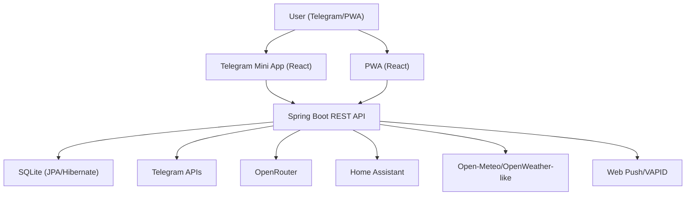
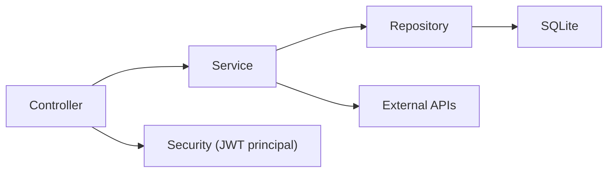
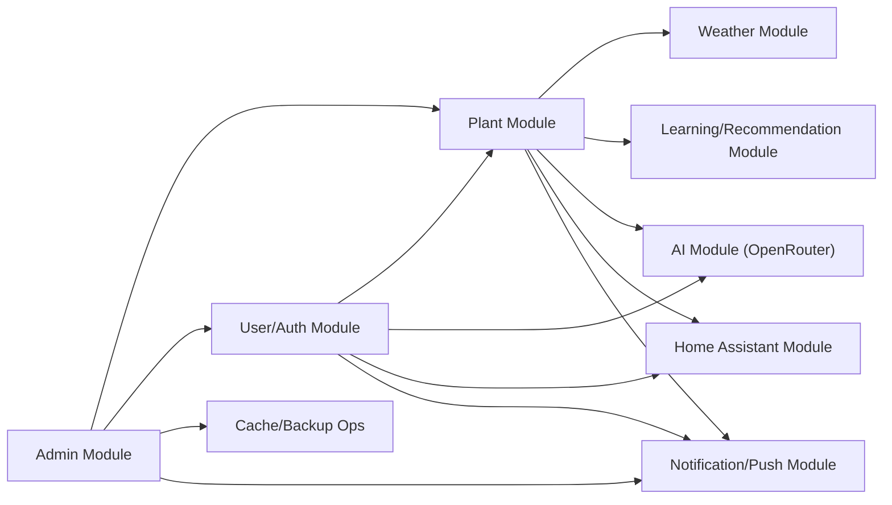

# Architecture

## 1. Architectural Style

**Type:** Modular monolith.

- Single backend deployable (`Spring Boot` JAR/container).
- Multiple functional modules inside one codebase (`plants`, `assistant`, `weather`, `home-assistant`, `admin`, `auth`, `push`).
- Two separate frontend projects (`plant-care-mini-app`, `plant-care-pwa`) consuming the same REST API.

## 2. System Context



## 3. Container-Level Diagram

```text
+--------------------------------------------------------------+
|                         plant-bot                            |
|                                                              |
|  +---------------------------+     +----------------------+   |
|  | Spring Boot Backend       | --> | SQLite DB file      |   |
|  | - REST API                |     | ./data/plantbot.db  |   |
|  | - Auth/JWT                |     +----------------------+   |
|  | - Schedulers              |                               |
|  +---------------------------+                               |
|              |                                               |
|              +--> static /mini-app (built Vite app)         |
|              +--> static /pwa      (built Vite app + SW)    |
+--------------------------------------------------------------+
```

## 4. Backend Layers



### Layer responsibilities

- `controller`: HTTP endpoints, request validation, response DTO mapping.
- `service`: domain logic, orchestration, integration, scheduling.
- `repository`: persistence queries via Spring Data JPA.
- `domain`: entities/enums.
- `config/security`: cross-cutting concerns (security, datasource, CORS, rate-limit).

## 5. Frontend Architecture

### PWA (`plant-care-pwa`)

- App shell in `src/app/App.tsx` using tab-driven navigation.
- State: Zustand (`src/lib/store.ts`).
- Data-fetching and API wrappers in `src/lib/api.ts`.
- Offline queue + cache in IndexedDB (`src/lib/indexeddb.ts`).
- UI: componentized screens + framer-motion transitions.

### Mini App (`plant-care-mini-app`)

- Same domain concepts with lighter UX surface.
- Uses same backend API contract.

## 6. Module Interaction Diagram



## 7. Security Model

- Stateless JWT auth for PWA endpoints (`Authorization: Bearer <token>`).
- Telegram init-data fallback for non-JWT flows (`X-Telegram-Init-Data`).
- Method and path restrictions:
  - `/api/admin/**` requires `ROLE_ADMIN`.
  - additional checks in `AdminController.requireAdmin(...)`.
- Admin rate limiting by remote IP (`AdminRateLimitInterceptor`).
- Sensitive token storage encrypted at rest:
  - OpenRouter user key: AES/GCM (`OpenRouterApiKeyCryptoService`).
  - Home Assistant token: AES/GCM (`AesTokenCryptoService`).

## 8. Data Flow Diagram (Typical)

### Water plant

```text
User taps "Water" in frontend
-> PUT /api/plants/{id}/water
-> MiniAppController.waterPlant
-> WateringRecommendationService + PlantService + WateringLogService
-> DB update (plant lastWateredDate + new watering_log row)
-> PlantResponse returned
-> UI re-renders next watering date
```

### AI photo diagnose

```text
Frontend sends base64 image
-> POST /api/plant/diagnose-openrouter
-> OpenRouterVisionService
-> OpenRouter API call
-> Parsed diagnosis DTO
-> UI diagnostic card
```

## 9. Scheduling / Background jobs

- `NotificationScheduler` for reminder workflows.
- `DatabaseBackupScheduler` for nightly backups + retention cleanup.
- `HomeAssistantPollingScheduler` for periodic HA condition polling.

## 10. Known Contract Gaps (Current Repo State)

Frontend API client references endpoints that are **not implemented** in backend controllers:

- `POST /api/openrouter/validate-key`
- `POST /api/openrouter/send`
- `GET /api/export/pdf`
- `POST /api/import/{provider}`
- `POST /api/backup/telegram`

These calls currently fail unless backend endpoints are added.

## 11. Deployment Notes

- Multi-stage Docker build compiles both frontends and backend into one runtime image.
- Static assets served by Spring Boot under `/mini-app` and `/pwa`.
- CI pipeline builds and pushes multi-arch images to GHCR (`.github/workflows/docker-publish.yml`).
