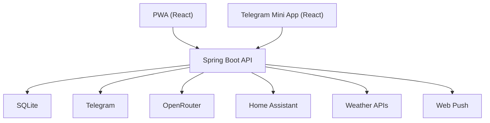
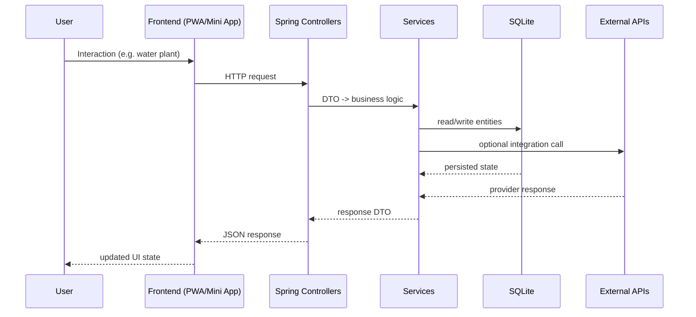

# Project Overview

## Purpose

Plant Bot ("Мои Растения") is a plant care platform that combines:

- plant tracking and watering reminders,
- weather-aware watering recommendations,
- AI-powered advice and photo diagnostics,
- Telegram + PWA user experience,
- Home Assistant integration,
- admin operations (users/plants/cache/backups/push/monitoring).

## Core Functionality

- CRUD for plants, watering events, and photos.
- Calendar view + ICS feed sync.
- AI assistant chat and AI care recommendation.
- OpenRouter vision endpoints for photo identify/diagnose.
- User weather provider selection and forecast/current weather preview.
- Home Assistant connection and sensor-based plant condition mapping.
- PWA auth, push subscriptions, migration analytics.
- Admin dashboard with moderation and operational tools.

## High-Level Architecture

```text
Frontend (React PWA + React Mini App)
  ↓ REST API
Backend (Spring Boot modular monolith)
  ↓ JPA/Hibernate
Database (SQLite)
```

---

# System Architecture

## Frontend

Two standalone Vite projects:

- `plant-care-pwa`: primary PWA UI with offline queue/cache and richer admin/settings UX.
- `plant-care-mini-app`: Telegram Mini App UI with shared domain flows.

Both use:

- React 19 + TypeScript,
- Zustand for local state,
- API wrappers in `src/lib/api.ts`.

## Backend

Single Spring Boot application exposing REST controllers under `/api/**`.

Main module areas:

- Plants and watering (`MiniAppController`, `PlantService`, `WateringRecommendationService`)
- AI (`OpenRouter*` services/controllers)
- Weather (`WeatherController`, `WeatherService`)
- Home Assistant (`HomeAssistantController`, `service/ha`)
- Auth and push (`PwaAuthController`, `PwaPushController`)
- Admin (`AdminController`, `AdminService`, `AdminInsightsService`)

## Database

- SQLite via JDBC + Hibernate SQLite dialect.
- Schema managed primarily by Hibernate (`ddl-auto: update`) with targeted manual adjustments in `SqliteSchemaInitializer`.

## External Services

- Telegram Bot / Telegram auth payloads.
- OpenRouter AI API.
- Open-Meteo + OpenWeather-compatible weather APIs.
- Home Assistant HTTP API.
- Web Push (VAPID).

## Textual Architecture Diagram



---

# Tech Stack

## Frontend

- React 19
- TypeScript 5
- Vite 7
- TailwindCSS 3
- Framer Motion
- Zustand
- TanStack Query
- TanStack Table (PWA)
- shadcn/ui-style primitives (local ui components)
- vite-plugin-pwa (PWA app)

## Backend

- Java 17
- Spring Boot 3.2
- Spring Web
- Spring Data JPA
- Spring Security
- Spring Actuator
- Lombok
- JJWT
- TelegramBots Java SDK
- web-push (VAPID)

## Database

- SQLite (`org.xerial:sqlite-jdbc`)
- Hibernate SQLite dialect (`hibernate-community-dialects`)

## Infrastructure

- Docker (multi-stage build)
- Docker Compose
- GitHub Actions (GHCR image publish)

## Testing / Quality

- Gradle test task configured.
- No substantial backend/frontend tests currently present in repository.

## Build Tools

- Gradle 8
- npm
- Vite

---

# Repository Structure

```text
.
├── src/main/java/com/example/plantbot
│   ├── controller         # REST endpoints
│   ├── controller/dto     # API request/response DTOs
│   ├── service            # business logic
│   ├── service/ha         # Home Assistant module logic
│   ├── service/auth       # PWA OAuth/telegram auth verification
│   ├── repository         # JPA repositories
│   ├── repository/ha      # HA-specific repositories
│   ├── domain             # JPA entities/enums
│   ├── domain/ha          # HA entities/enums
│   ├── security           # JWT filter, token service, principal
│   ├── config             # datasource/security/cors/rate-limit/init config
│   └── util               # domain utility records/classes
├── src/main/resources
│   └── application.yml    # backend configuration
├── plant-care-pwa         # PWA frontend
├── plant-care-mini-app    # Telegram Mini App frontend
├── Dockerfile             # build backend + both frontends into one image
├── docker-compose.yml     # runtime services and env wiring
├── .env.example           # backend env template
└── .github/workflows      # CI/CD pipeline
```

### Frontend sub-structure (PWA)

- `src/app`: page-level screens.
- `src/components`: reusable UI/feature components.
- `src/lib`: API client, offline queue, auth helpers, store, theme utils.
- `src/types`: API and domain typings.

### Frontend sub-structure (Mini App)

- Similar structure with smaller surface area (`app`, `components`, `lib`, `types`).

---

# Backend Documentation

## Architecture Layers

## Controllers

HTTP layer for:

- validation and request parsing,
- auth/ownership checks,
- service orchestration and DTO responses.

## Services

Business logic and integration boundaries:

- recommendation/learning logic,
- external API calls,
- encryption/decryption for sensitive tokens,
- schedulers for backups/notifications/polling.

## Repositories

Spring Data JPA repositories for entity persistence and read models.

## Models (Entities)

Main entities:

- `User`: account/profile/settings/roles/weather provider/auth fields.
- `Plant`: plant profile, watering schedule baseline, placement/category, photo.
- `WateringLog`: watering event history.
- `AssistantChatHistory`: saved AI interactions.
- `AuthIdentity`: provider identity bindings.
- `WebPushSubscription`: web push endpoints/keys/status.
- `OpenRouterCacheEntry`, dictionary/cache entities.
- HA entities: `HomeAssistantConnection`, `PlantHomeAssistantBinding`, `PlantConditionSample`, `PlantAdjustmentLog`.

## API Documentation

> Auth modes used by endpoints:
>
> - `JWT`: `Authorization: Bearer <token>` required.
> - `TG`: `X-Telegram-Init-Data` user resolution path.
> - `ADMIN`: requires `ROLE_ADMIN`.

### Core Plant API (`MiniAppController`)

| Method | URL | Description | Request Body | Response | Auth |
|---|---|---|---|---|---|
| POST | `/api/auth/validate` | Validate user session and return profile payload | none | `AuthValidateResponse` | TG/JWT |
| GET | `/api/plants` | List current user plants | none | `List<PlantResponse>` | TG/JWT |
| GET | `/api/plants/{id}` | Get one plant by id (owned) | none | `PlantResponse` | TG/JWT |
| GET | `/api/plants/search` | Search plants by `q`, optional `category` | none | `List<PlantResponse>` | TG/JWT |
| GET | `/api/plants/presets` | Preset names by category/query | none | `List<PlantPresetSuggestionResponse>` | TG/JWT |
| POST | `/api/plants` | Create plant | `CreatePlantRequest` | `PlantResponse` | TG/JWT |
| PUT | `/api/plants/{id}/water` | Mark plant watered now | none | `PlantResponse` | TG/JWT |
| POST | `/api/plants/{id}/photo` | Upload plant photo (base64) | `PlantPhotoRequest` | `PhotoUploadResponse` | TG/JWT |
| GET | `/api/plants/{id}/photo` | Get signed photo bytes | query `exp`,`sig` | `ResponseEntity<byte[]>` | signed URL |
| DELETE | `/api/plants/{id}` | Delete plant | none | `204/void` | TG/JWT |
| GET | `/api/plants/{id}/care-advice` | AI care advice for plant | none | `PlantCareAdviceResponse` | TG/JWT |
| POST | `/api/plants/ai-recommend` | AI wizard recommendation | `PlantAiRecommendRequest` | `PlantAiRecommendResponse` | TG/JWT |
| GET | `/api/plants/suggest-profile` | Suggest interval/type by plant name | none | `PlantProfileSuggestionResponse` | TG/JWT |

### Calendar / Learning / Assistant (`MiniAppController`)

| Method | URL | Description | Request Body | Response | Auth |
|---|---|---|---|---|---|
| GET | `/api/calendar` | Upcoming watering calendar | none | `List<CalendarEventResponse>` | TG/JWT |
| GET | `/api/stats` | Plant watering stats | none | `List<PlantStatsResponse>` | TG/JWT |
| GET | `/api/learning` | Adaptive learning metrics | none | `List<PlantLearningResponse>` | TG/JWT |
| POST | `/api/assistant/chat` | Ask AI assistant | `ChatAskRequest` | `ChatAskResponse` | TG/JWT |
| GET | `/api/assistant/history` | Assistant chat history | none | `List<AssistantChatHistoryItemResponse>` | TG/JWT |
| DELETE | `/api/assistant/history` | Clear assistant history | none | `{"ok":true}` | TG/JWT |
| POST | `/api/users/city` | Save user city | `CityUpdateRequest` | `AuthValidateResponse` | TG/JWT |
| GET | `/api/calendar/sync` | Calendar sync status/URLs | none | `CalendarSyncResponse` | TG/JWT |
| POST | `/api/calendar/sync` | Enable/disable calendar sync | `CalendarSyncRequest` | `CalendarSyncResponse` | TG/JWT |
| GET | `/api/calendar/ics/{token}` | Public ICS feed by token | none | `text/calendar` | token |

### Weather API (`WeatherController`)

| Method | URL | Description | Request Body | Response | Auth |
|---|---|---|---|---|---|
| GET | `/api/weather/providers` | List weather providers + selected | none | `WeatherProviderResponse` | TG/JWT |
| POST | `/api/weather/provider` | Save selected provider | `ProviderRequest` | `WeatherProviderResponse` | TG/JWT |
| GET | `/api/weather/current` | Current weather by city/user settings | none | `WeatherCurrentResponse` | TG/JWT |
| GET | `/api/weather/forecast` | Forecast by city/user settings | none | `WeatherForecastResponse` | TG/JWT |

### OpenRouter AI API

#### Vision endpoints (`OpenRouterAiController`)

| Method | URL | Description | Request Body | Response | Auth |
|---|---|---|---|---|---|
| POST | `/api/plant/identify-openrouter` | Identify plant from image | `OpenRouterIdentifyRequest` | `OpenRouterIdentifyResponse` | TG/JWT |
| POST | `/api/plant/diagnose-openrouter` | Diagnose plant issue from image | `OpenRouterDiagnoseRequest` | `OpenRouterDiagnoseResponse` | TG/JWT |

#### Model/preferences endpoints (`OpenRouterSettingsController`)

| Method | URL | Description | Request Body | Response | Auth |
|---|---|---|---|---|---|
| GET | `/api/openrouter/models` | Fetch available models | none | `OpenRouterModelsResponse` | TG/JWT |
| GET | `/api/openrouter/preferences` | Get user model prefs + key presence flag | none | `OpenRouterModelPreferencesResponse` | TG/JWT |
| POST | `/api/openrouter/preferences` | Save model prefs and optional API key | `OpenRouterModelPreferencesRequest` | `OpenRouterModelPreferencesResponse` | TG/JWT |
| DELETE | `/api/openrouter/preferences/api-key` | Clear user OpenRouter API key | none | `OpenRouterModelPreferencesResponse` | TG/JWT |

### Home Assistant API (`HomeAssistantController`)

| Method | URL | Description | Request Body | Response | Auth |
|---|---|---|---|---|---|
| POST | `/api/home-assistant/config` | Save HA connection and probe it | `HomeAssistantConfigRequest` | `HomeAssistantConfigResponse` | TG/JWT |
| GET | `/api/home-assistant/rooms-and-sensors` | Fetch rooms/sensors list | none | `HomeAssistantRoomsSensorsResponse` | TG/JWT |
| PUT | `/api/plants/{plantId}/room` | Bind plant to HA area/sensors | `PlantRoomBindingRequest` | `PlantConditionsResponse` | TG/JWT |
| GET | `/api/plants/{plantId}/conditions` | Current plant conditions | none | `PlantConditionsResponse` | TG/JWT |
| GET | `/api/plants/{plantId}/history-conditions` | Conditions history | none | `PlantConditionsHistoryResponse` | TG/JWT |

### PWA Auth API (`PwaAuthController`)

| Method | URL | Description | Request Body | Response | Auth |
|---|---|---|---|---|---|
| GET | `/api/pwa/auth/providers` | Return provider list | none | `PwaAuthProviderResponse` | public |
| POST | `/api/pwa/auth/telegram` | Telegram init-data login | `PwaAuthTelegramRequest` | `PwaAuthResponse` | public |
| POST | `/api/pwa/auth/telegram-widget` | Telegram widget payload login | `PwaAuthTelegramWidgetRequest` | `PwaAuthResponse` | public |
| POST | `/api/pwa/auth/oauth/{provider}` | OAuth login by provider | `PwaAuthOAuthRequest` | `PwaAuthResponse` | public |
| GET | `/api/pwa/auth/me` | Current JWT user profile | none | `PwaUserResponse` | JWT |

### PWA Push API (`PwaPushController`)

| Method | URL | Description | Request Body | Response | Auth |
|---|---|---|---|---|---|
| GET | `/api/pwa/push/public-key` | Return push enable/public VAPID key | none | `PwaPushPublicKeyResponse` | public |
| GET | `/api/pwa/push/status` | User subscription status | none | `PwaPushStatusResponse` | JWT |
| POST | `/api/pwa/push/subscribe` | Save push subscription | `PwaPushSubscriptionRequest` | `PwaPushSubscribeResponse` | JWT |
| DELETE | `/api/pwa/push/subscribe` | Remove one/all subscriptions | query `endpoint` optional | `PwaPushSubscribeResponse` | JWT |

### Migration Analytics API (`PwaMigrationController`)

| Method | URL | Description | Request Body | Response | Auth |
|---|---|---|---|---|---|
| GET | `/api/pwa/migration/decision` | Return migration decision payload | none | `PwaMigrationDecisionResponse` | TG/JWT |
| POST | `/api/pwa/migration/track` | Track migration event | `PwaMigrationTrackRequest` | `PwaMigrationTrackResponse` | TG/JWT |
| POST | `/api/analytics/migration` | Generic migration analytics track | `PwaMigrationAnalyticsRequest` | `PwaMigrationTrackResponse` | TG/JWT |
| GET | `/api/analytics/migration/stats` | Migration KPI stats | none | `PwaMigrationStatsResponse` | ADMIN |

### Achievements API (`AchievementController`)

| Method | URL | Description | Request Body | Response | Auth |
|---|---|---|---|---|---|
| GET | `/api/user/achievements` | Read achievement state | none | `AchievementsResponse` | TG/JWT |
| POST | `/api/user/achievements/check` | Recalculate achievements | none | `AchievementsResponse` | TG/JWT |

### Admin API (`AdminController`)

All endpoints below require `ROLE_ADMIN`.

| Method | URL | Description | Request Body | Response |
|---|---|---|---|---|
| GET | `/api/admin/overview` | Dashboard overview | none | `AdminOverviewResponse` |
| GET | `/api/admin/users` | Paginated user list | none | `AdminUsersResponse` |
| GET | `/api/admin/users/{userId}/details` | User details | none | `AdminUserDetailsResponse` |
| POST | `/api/admin/users/{userId}/block` | Block/unblock user | `AdminUserBlockRequest` | `AdminUserActionResponse` |
| DELETE | `/api/admin/users/{userId}` | Delete user | none | `AdminUserActionResponse` |
| GET | `/api/admin/users/{userId}/plants` | User plants | none | `List<AdminPlantItemResponse>` |
| GET | `/api/admin/stats` | Admin statistics | none | `AdminStatsResponse` |
| GET | `/api/admin/monitoring` | Online/session/error metrics | none | `AdminMonitoringResponse` |
| GET | `/api/admin/activity/logs` | Activity log feed | none | `List<AdminActivityLogItemResponse>` |
| POST | `/api/admin/clear-cache` | Clear all caches | none | `AdminCacheClearResponse` |
| POST | `/api/admin/clear-cache/{scope}` | Clear scoped cache (`weather/openrouter/users`) | none | `AdminScopedCacheClearResponse` |
| GET | `/api/admin/backups` | List backups | none | `List<AdminBackupItemResponse>` |
| POST | `/api/admin/backups/create` | Create backup now | none | `AdminBackupItemResponse` |
| POST | `/api/admin/backup/create` | Alias for create backup | none | `AdminBackupItemResponse` |
| POST | `/api/admin/backups/{fileName}/restore` | Restore backup | none | `AdminBackupRestoreResponse` |
| POST | `/api/admin/push/test` | Send test push | `AdminPushTestRequest` | `AdminPushTestResponse` |
| GET | `/api/admin/plants` | Paginated plant list | none | `AdminPlantsResponse` |
| POST | `/api/admin/plants/{plantId}/water` | Water one plant | none | `AdminPlantActionResponse` |
| POST | `/api/admin/plants/water-overdue` | Bulk water overdue plants | `AdminBulkPlantWaterRequest` | `AdminBulkPlantWaterResponse` |
| DELETE | `/api/admin/plants/{plantId}` | Delete plant | none | `AdminPlantActionResponse` |
| PATCH | `/api/admin/plants/{plantId}` | Update plant fields | `AdminPlantUpdateRequest` | `AdminPlantItemResponse` |
| GET | `/api/admin/dictionary/merge-tasks` | Dictionary merge task queue | none | `List<AdminMergeTaskItemResponse>` |
| POST | `/api/admin/dictionary/merge-tasks/{taskId}/retry` | Retry merge task | none | `AdminMergeTaskRetryResponse` |

### Static Web routes

| Method | URL | Purpose |
|---|---|---|
| GET | `/mini-app/**` | Serve Mini App SPA entry (`MiniAppWebController`) |
| GET | `/pwa/**` | Serve PWA SPA entry (`PwaWebController`) |

---

# Frontend Documentation

## Structure

### `plant-care-pwa`

- `src/app`: screen-level components (`Plants`, `Calendar`, `AddPlant`, `AIAssistant`, `Settings`, `Admin`, `auth`).
- `src/components`: reusable UI widgets and feature components.
- `src/lib/api.ts`: API contract layer + offline mutation queue integration.
- `src/lib/indexeddb.ts`: local cache/mutation queue for offline resilience.
- `src/lib/store.ts`: global state (auth/ui/offline).
- `src/types/api.ts`: TypeScript API DTO contracts.

### `plant-care-mini-app`

- Similar structure, smaller scope, Telegram-first UX.

## UI Architecture

- Container components: screen files in `src/app/**`.
- Presentational components: reusable pieces in `src/components/**`.
- Service/data layer: centralized fetch wrappers in `src/lib/api.ts`.
- State management: Zustand stores for auth/navigation/offline status.

---

# Data Flow



---

# Environment Configuration

## Backend env vars (`.env.example`)

| Variable | Purpose |
|---|---|
| `TELEGRAM_BOT_TOKEN`, `TELEGRAM_BOT_USERNAME` | Telegram bot and auth validation |
| `TELEGRAM_BOT_ENABLED` | Enable/disable bot runtime |
| `SPRING_DATASOURCE_URL` | SQLite JDBC URL |
| `DB_POOL_*`, `DB_CONNECTION_TIMEOUT_MS` | Hikari pool settings |
| `OPENROUTER_*` | OpenRouter model/api/cache settings |
| `OPENWEATHER_API_KEY` | OpenWeather key (fallback/provider mode) |
| `PERENUAL_API_KEY` | Plant catalog integration |
| `APP_SECURITY_JWT_*` | JWT secret/ttl/issuer |
| `APP_BACKUP_*` | Backup scheduler config |
| `APP_ADMIN_*` | Admin telegram id and rate-limit controls |
| `WEB_PUSH_*` | Web push enable + VAPID keys |
| `WEB_CORS_ALLOWED_ORIGINS` | CORS allowed origins |
| `APP_PUBLIC_BASE_URL` | Base URL for signed links/ICS |
| `APP_DEV_AUTH_ENABLED`, `APP_DEV_TELEGRAM_ID`, `APP_DEV_USERNAME` | Local dev auth mode |
| `HTTP_CLIENT_*` | Outbound HTTP timeout settings |
| `TZ` | Runtime timezone |

## Frontend env vars

### `plant-care-pwa/.env.example`

- `VITE_API_BASE_URL`: backend API base URL.

### `plant-care-mini-app/.env.example`

- `VITE_API_BASE_URL`: backend API base URL.
- `VITE_PWA_URL`: PWA URL used in migration flow.

---

# Setup Guide

## 1. Clone repository

```bash
git clone <repo-url>
cd plant-bot
```

## 2. Install backend dependencies

```bash
./gradlew dependencies
```

## 3. Configure env

```bash
cp .env.example .env
```

## 4. Run backend

```bash
./gradlew bootRun
```

## 5. Run PWA frontend

```bash
cd plant-care-pwa
cp .env.example .env
npm install
npm run dev
```

## 6. Run Mini App frontend (optional)

```bash
cd ../plant-care-mini-app
cp .env.example .env
npm install
npm run dev
```

## 7. Docker option

```bash
docker compose up -d --build
```

---

# Development Guide

## Add new API endpoint

1. Add DTO(s) in `controller/dto`.
2. Add business logic in `service`.
3. Add/extend repository query in `repository` if required.
4. Expose endpoint in relevant controller.
5. Add auth/role/ownership checks.
6. Update frontend `src/types/api.ts` and `src/lib/api.ts`.
7. Wire UI.

## Add new service

1. Create service class under `service` package.
2. Keep external API calls inside service layer.
3. Inject dependencies via constructor.
4. Add transaction annotations where needed.

## Add new frontend page/component

1. Create screen in `plant-care-pwa/src/app/<Feature>`.
2. Add reusable blocks to `src/components`.
3. Integrate navigation in `App.tsx`/tab shell.
4. Add API wrappers + types before UI wiring.

---

# Testing Guide

## Current state

- No substantial automated test suites are present.
- `./gradlew test` is configured but repository currently has no meaningful tests.
- Frontends do not include active unit/e2e test setup.

## Recommended smoke checks

```bash
# Backend compile
./gradlew clean compileJava

# Backend run
./gradlew bootRun

# Health endpoint
curl -sS http://localhost:8080/actuator/health

# PWA build
cd plant-care-pwa && npm run build

# Mini App build
cd ../plant-care-mini-app && npm run build
```

---

# AI Assistant Guide

## Project map

- Backend logic: `src/main/java/com/example/plantbot/service/**`
- API layer: `src/main/java/com/example/plantbot/controller/**`
- Database models: `src/main/java/com/example/plantbot/domain/**`
- Frontend screens/components: `plant-care-pwa/src/app/**`, `plant-care-pwa/src/components/**`
- Frontend API contracts: `plant-care-pwa/src/lib/api.ts`, `plant-care-pwa/src/types/api.ts`
- Configuration: `.env.example`, `src/main/resources/application.yml`

## Safe modification rules

- Keep backend and frontend API contracts synchronized.
- Preserve `ROLE_ADMIN` protection and admin audit-style logs.
- Keep token encryption flows intact (`OpenRouterApiKeyCryptoService`, `AesTokenCryptoService`).
- Keep ownership checks for user-scoped resources.
- Avoid modifying security/cors defaults unless required.

## Typical AI tasks

### Add endpoint

- Update DTO + controller + service + repository.
- Update frontend type + API wrapper.
- Add manual smoke verification steps.

### Change UI

- Modify screen component in `src/app`.
- Reuse shared components in `src/components`.
- Keep state changes in Zustand store or screen container.

### Add full feature

- Start from backend contract.
- Then update frontend contract/types.
- Then implement UI.
- Then validate through end-to-end manual flow.

## Important current mismatch

Frontend references non-existent backend endpoints:

- `POST /api/openrouter/validate-key`
- `POST /api/openrouter/send`
- `GET /api/export/pdf`
- `POST /api/import/{provider}`
- `POST /api/backup/telegram`

Implement backend support before relying on these flows.
